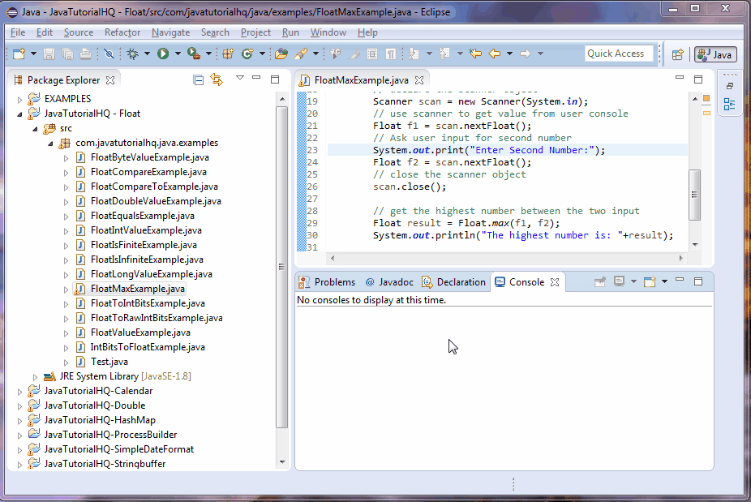

# OOC1 Project

**Title:** Items Application Manager  
**Name:** Patrick Murphy  
**Student ID:** G00123456  

## Application Function

Discuss, in detail, what the application does. Add a screenshot of the application in use (See example of image added below).

## Running the Application

Provide step by step instructions on how to run your applicaiton. Are there any prerequisite softwares required?

```list
List the instructions step by step
    1. Clone this repository to your desktop.
    2. Open it with Eclipse
            :
            :
```

## Minimum Project Requirements

Describe how you have met all minimum project requirements below:

* The repository contains, at minimum, two commits per week (Note: There should be many commits per day coding).
* The project, including code and documentation, is fully contained in the provided GitHub Classroom repository.
* Methods = Add Item, Remove Item, Update Item, Find total items, Search Items and Quit.
* The code MUST compile. 30% grade reduction if code does not compile.
* The application code must be formatted in a consistent and standard way.
* The code must contain comments. One comment per class, method and variable at minimum.
* The documentation and commentary must be free of a grammar and speling mistakes.

## Project Requirements above and beyond

Discuss any application features or design elements that show you went above and beyond basic requirements.

## Application Architecture

Discuss in detail how the application is structured. List all classes and describe their purpose. List all methods and describe what they do.

## User Demo

Discuss the console design used. Discuss why you chose this design and any features you thing make your application stands out. Add a gif of the application in use like below:



## Roadblocks and Unfinished Functionality

What did you not get finished? Discuss the issues you faced when creating your application Provide possible solutions to these issues. What would you have done differently if you had to do this project again?

## Resources

Provide links to resources used:

* [Tutorialspoint](https://www.tutorialspoint.com/java/) - Java Tutorials site I found helpful
